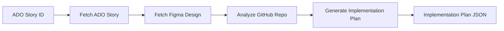
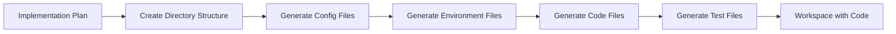
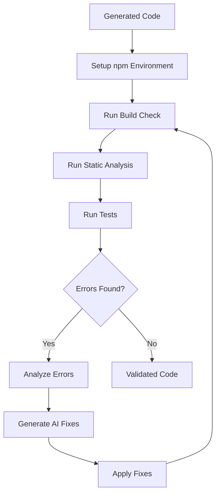
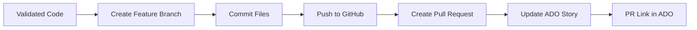

# MTN-SDLC Architecture Documentation

> **AI-Powered Software Development Lifecycle Automation System**

This document provides a comprehensive overview of the MTN-SDLC system architecture, explaining how the AI agents work together to automate the entire software development lifecycle from requirements to deployment.

---

## Table of Contents

1. [System Overview](#system-overview)
2. [Architecture Diagram Prompt](#architecture-diagram-prompt)
3. [Directory Structure](#directory-structure)
4. [Agent Pipeline](#agent-pipeline)
5. [Integration Clients](#integration-clients)
6. [Data Flow](#data-flow)
7. [Tool Categories](#tool-categories)
8. [Data Models](#data-models)
9. [Getting Started](#getting-started)
10. [Testing](#testing)
11. [Configuration Reference](#configuration-reference)

---

## System Overview

MTN-SDLC is an AI-powered automation system that transforms a user story in Azure DevOps into production-ready code with a pull request on GitHub. It leverages **Google Gemini AI** for intelligent code generation and uses a multi-agent architecture where each agent handles a specific phase of the SDLC.

### Key Capabilities
- **Automated Requirement Analysis**: Fetches ADO stories, Figma designs, and analyzes GitHub repo structure
- **AI-Powered Code Generation**: Uses Gemini AI to generate React/TypeScript code from designs
- **Self-Healing Testing**: Automatically detects and fixes code issues through iterative validation
- **Seamless Deployment**: Creates GitHub branches, commits code, and opens pull requests
- **Security Scanning**: Built-in vulnerability detection and auto-remediation

---

## Architecture Diagram Prompt

> **Use this prompt with Gemini or any AI image generator to create an architecture diagram:**

```
Create a professional software architecture diagram for an AI-powered SDLC automation system with the following components:

**External Services (Left Side):**
- Azure DevOps (ADO) - with work item icon
- Figma - with design icon
- GitHub - with repository icon

**Core System (Center):**
A FastAPI server at the center with 4 connected AI agents arranged vertically:

1. Agent 1: Requirement Gathering Agent
   - Tools: Fetch ADO Story, Fetch Figma Design, Analyze GitHub Repo, Generate Implementation Plan
   - Connects to: ADO, Figma, GitHub (input), AI Engine
   
2. Agent 2: Development Agent  
   - Tools: Create Directory Structure, Generate Code Files, Generate Test Files, Generate Config Files, Generate Environment Files
   - Connects to: Agent 1 output, AI Engine
   
3. Agent 3: Testing & Debugging Agent
   - Tools: Setup Environment, Run Static Analysis, Run Tests, Analyze Errors, Generate Fix Code
   - Features a "Self-Healing Loop" circular arrow showing: Validate → Analyze → Fix → Repeat
   - Connects to: Agent 2 output, AI Engine
   
4. Agent 4: Deployment Agent
   - Tools: Create Branch, Commit Files, Push to GitHub, Create Pull Request, Update ADO Status
   - Connects to: Agent 3 output, GitHub (output), ADO (output)

**AI Engine (Right Side):**
- Google Gemini AI box
- Shows connections to all 4 agents
- Label: "gemini-2.0-flash / gemini-2.5-pro"

**Data Flow:**
- Arrows showing: ADO Story → Agent 1 → Implementation Plan → Agent 2 → Generated Code → Agent 3 → Validated Code → Agent 4 → GitHub PR
- Return arrow from Agent 4 to ADO showing "Status Update"

**Style:**
- Modern, clean design with rounded rectangles
- Color coding: Blue for external services, Green for agents, Purple for AI engine
- Include icons for each service
- Show data flow with labeled arrows
- Include a legend
```

---

## Directory Structure

```
MTN-SDLC/
├── src/                          # Main source code
│   ├── agents/                   # AI Agent implementations
│   │   ├── requirement_gathering_agent.py   # Agent 1: Understands requirements
│   │   ├── development_agent.py             # Agent 2: Generates code
│   │   ├── testing_debugging_agent.py       # Agent 3: Tests & fixes code
│   │   ├── deployment_agent.py              # Agent 4: Deploys to GitHub
│   │   ├── security_agent.py                # Bonus: Security scanning
│   │   └── feedback_review_agent.py         # Bonus: PR feedback handling
│   │
│   ├── integrations/             # External API clients
│   │   ├── azure_devops_client.py   # ADO REST API client
│   │   ├── figma_client.py          # Figma REST API client
│   │   ├── github_client.py         # GitHub REST API client
│   │   ├── gemini_client.py         # Google Gemini AI client
│   │   ├── vision_client.py         # Image analysis via Gemini Vision
│   │   ├── mock_clients.py          # Mock implementations for testing
│   │   └── client_factory.py        # Factory for real/mock client selection
│   │
│   ├── tools/                    # Agent tools (atomic operations)
│   │   ├── data_collection/      # Tools for Agent 1
│   │   │   ├── fetch_ado_story.py
│   │   │   ├── fetch_figma_design.py
│   │   │   ├── analyze_github_repo.py
│   │   │   └── generate_implementation_plan.py
│   │   │
│   │   ├── code_generation/      # Tools for Agent 2
│   │   │   ├── create_directory_structure.py
│   │   │   ├── generate_code_files.py
│   │   │   ├── generate_test_files.py
│   │   │   ├── generate_config_files.py
│   │   │   └── generate_environment_files.py
│   │   │
│   │   ├── validation_testing/   # Tools for Agent 3
│   │   │   ├── setup_environment.py
│   │   │   ├── run_static_analysis.py
│   │   │   ├── run_tests.py
│   │   │   ├── analyze_error_logs.py
│   │   │   └── generate_fix_code.py
│   │   │
│   │   ├── github_operations/    # Tools for Agent 4
│   │   │   ├── create_github_branch.py
│   │   │   ├── commit_files.py
│   │   │   ├── push_to_github.py
│   │   │   ├── create_pull_request.py
│   │   │   └── update_ado_story_status.py
│   │   │
│   │   ├── security/             # Security scanning tools
│   │   └── feedback_loop/        # PR feedback tools
│   │
│   ├── models/                   # Pydantic data models
│   │   ├── story_model.py           # ADOStory, AcceptanceCriteria
│   │   ├── design_model.py          # FigmaDesign, DesignTokens
│   │   ├── implementation_plan.py   # ImplementationPlan, Task
│   │   └── validation_result.py     # ValidationResult, FixAttempt
│   │
│   ├── utils/                    # Shared utilities
│   │   └── logging.py               # Structured logging
│   │
│   ├── main.py                   # FastAPI application entry point
│   └── config.py                 # Configuration & environment variables
│
├── cloud_functions/              # GCP Cloud Functions (webhooks)
│   ├── ado_webhook_handler/      # Azure DevOps webhook receiver
│   ├── github_webhook_handler/   # GitHub webhook receiver
│   └── security_monitor/         # Security alert processor
│
├── tests/                        # Test suite
├── scripts/                      # Utility scripts
├── deployment/                   # Deployment configurations
├── docs/                         # Additional documentation
│
├── .env.example                  # Environment variable template
├── requirements.txt              # Python dependencies
├── Dockerfile                    # Container configuration
└── cloudbuild.yaml               # GCP Cloud Build configuration
```

---

## Agent Pipeline

The system operates as a sequential pipeline where each agent processes the output of the previous one.

### Agent 1: Requirement Gathering Agent
**Purpose**: Understand what needs to be built by gathering all requirements.



**Data Sources**:
- **Azure DevOps**: Work item title, description, acceptance criteria, story points
- **Figma**: Design components, colors, typography, layout structure
- **GitHub**: Existing code patterns, project structure, dependencies

**Output**: A structured implementation plan with tasks, file specifications, and component definitions.

---

### Agent 2: Development Agent
**Purpose**: Generate all production code based on the implementation plan.



**Generated Files**:
- React/TypeScript components matching Figma designs
- Jest test files for each component
- `package.json`, `tsconfig.json`, ESLint/Prettier configs
- `.env` files with placeholders

---

### Agent 3: Testing & Debugging Agent
**Purpose**: Validate code quality and automatically fix any issues.



**Self-Healing Loop**:
1. Validate code with TypeScript compiler and ESLint
2. If errors found, use Gemini AI to analyze and generate fixes
3. Apply fixes and re-validate
4. Repeat up to `SELF_HEALING_MAX_ATTEMPTS` (default: 5) times

---

### Agent 4: Deployment Agent
**Purpose**: Deploy validated code to GitHub and update ADO.



**GitHub Operations**:
- Creates branch: `feature/story-{id}-{timestamp}`
- Commits all generated files with descriptive message
- Opens PR with implementation details and validation report
- Links PR back to ADO work item

---

## Integration Clients

### Where the System Gets Information

| Integration | Client | Purpose | Data Retrieved |
|------------|--------|---------|----------------|
| **Azure DevOps** | `AzureDevOpsClient` | Work item management | Story title, description, acceptance criteria, assigned user, story points, related links |
| **Figma** | `FigmaClient` | Design extraction | Component hierarchy, design tokens (colors, typography, spacing), layout structure, component names |
| **Figma Vision** | `FigmaVisionClient` | Screenshot analysis | Uses Gemini Vision to analyze Figma screenshots when API access is limited |
| **GitHub** | `GitHubClient` | Repository operations | Existing code structure, dependencies, coding patterns, branch management, PR creation |
| **Gemini AI** | `GeminiClient` | AI generation | Implementation plans, React components, tests, error fixes, security analysis |

### Client Factory Pattern
The system uses a factory pattern (`client_factory.py`) that supports:
- **Mock Mode**: All clients return predefined test data (no real API calls)
- **Hybrid Mode**: Individual services can be mocked (e.g., mock ADO, real GitHub)
- **Production Mode**: All real API connections

```python
# Example: Granular mock control
MOCK_ADO=true      # Use mock ADO story
MOCK_FIGMA=false   # Use real Figma API
MOCK_GITHUB=false  # Use real GitHub API
```

---

## Data Flow

```
┌─────────────────────────────────────────────────────────────────────────────┐
│                              API REQUEST                                     │
│          POST /api/v1/process-story {"story_id": 12345}                     │
└─────────────────────────────────────────────────────────────────────────────┘
                                      │
                                      ▼
┌─────────────────────────────────────────────────────────────────────────────┐
│                         AGENT 1: REQUIREMENT GATHERING                       │
│  ┌─────────────┐   ┌─────────────┐   ┌─────────────┐   ┌──────────────────┐ │
│  │ ADO Story   │ → │ Figma       │ → │ GitHub      │ → │ Implementation   │ │
│  │ Fetch       │   │ Design      │   │ Repo        │   │ Plan (AI)        │ │
│  └─────────────┘   └─────────────┘   └─────────────┘   └──────────────────┘ │
└─────────────────────────────────────────────────────────────────────────────┘
                                      │
                                      ▼ Implementation Plan
┌─────────────────────────────────────────────────────────────────────────────┐
│                         AGENT 2: DEVELOPMENT                                 │
│  ┌─────────────┐   ┌─────────────┐   ┌─────────────┐   ┌──────────────────┐ │
│  │ Directory   │ → │ Config      │ → │ Code        │ → │ Test             │ │
│  │ Structure   │   │ Files       │   │ Files (AI)  │   │ Files (AI)       │ │
│  └─────────────┘   └─────────────┘   └─────────────┘   └──────────────────┘ │
└─────────────────────────────────────────────────────────────────────────────┘
                                      │
                                      ▼ Generated Workspace
┌─────────────────────────────────────────────────────────────────────────────┐
│                 AGENT 3: TESTING & DEBUGGING (Self-Healing Loop)            │
│  ┌─────────────┐   ┌─────────────┐   ┌─────────────┐   ┌──────────────────┐ │
│  │ npm install │ → │ tsc / ESLint│ → │ Jest Tests  │ → │ AI Error Fix     │ │
│  │ Setup       │   │ Validation  │   │             │   │ (if needed)      │ │
│  └─────────────┘   └─────────────┘   └─────────────┘   └──────────────────┘ │
│                                           ↑___________________________________│
└─────────────────────────────────────────────────────────────────────────────┘
                                      │
                                      ▼ Validated Code
┌─────────────────────────────────────────────────────────────────────────────┐
│                         AGENT 4: DEPLOYMENT                                  │
│  ┌─────────────┐   ┌─────────────┐   ┌─────────────┐   ┌──────────────────┐ │
│  │ Create      │ → │ Commit      │ → │ Create      │ → │ Update ADO       │ │
│  │ Branch      │   │ & Push      │   │ Pull Request│   │ Story Status     │ │
│  └─────────────┘   └─────────────┘   └─────────────┘   └──────────────────┘ │
└─────────────────────────────────────────────────────────────────────────────┘
                                      │
                                      ▼
┌─────────────────────────────────────────────────────────────────────────────┐
│                              API RESPONSE                                    │
│          {"success": true, "pr_url": "https://github.com/...", ...}         │
└─────────────────────────────────────────────────────────────────────────────┘
```

---

## Tool Categories

### Data Collection Tools (Agent 1)
| Tool | File | Purpose |
|------|------|---------|
| `fetch_ado_story_tool` | `fetch_ado_story.py` | Fetches work item from Azure DevOps |
| `fetch_figma_design_tool` | `fetch_figma_design.py` | Extracts design from Figma API |
| `analyze_github_repo_tool` | `analyze_github_repo.py` | Analyzes existing repository structure |
| `generate_implementation_plan_tool` | `generate_implementation_plan.py` | Uses AI to create execution plan |

### Code Generation Tools (Agent 2)
| Tool | File | Purpose |
|------|------|---------|
| `create_directory_structure_tool` | `create_directory_structure.py` | Creates folder hierarchy |
| `generate_code_files_tool` | `generate_code_files.py` | AI-generates React components |
| `generate_test_files_tool` | `generate_test_files.py` | AI-generates Jest tests |
| `generate_config_files_tool` | `generate_config_files.py` | Creates tsconfig, eslint, etc. |
| `generate_environment_files_tool` | `generate_environment_files.py` | Creates .env templates |

### Validation & Testing Tools (Agent 3)
| Tool | File | Purpose |
|------|------|---------|
| `setup_environment_tool` | `setup_environment.py` | Runs npm install, prepares workspace |
| `run_static_analysis_tool` | `run_static_analysis.py` | Runs ESLint and TypeScript compiler |
| `run_tests_tool` | `run_tests.py` | Executes Jest test suite |
| `analyze_error_logs_tool` | `analyze_error_logs.py` | AI analyzes errors for root cause |
| `generate_fix_code_tool` | `generate_fix_code.py` | AI generates code fixes |

### GitHub Operations Tools (Agent 4)
| Tool | File | Purpose |
|------|------|---------|
| `create_github_branch_tool` | `create_github_branch.py` | Creates feature branch |
| `commit_files_tool` | `commit_files.py` | Commits generated files |
| `push_to_github_tool` | `push_to_github.py` | Pushes branch to remote |
| `create_pull_request_tool` | `create_pull_request.py` | Opens PR with description |
| `update_ado_story_status_tool` | `update_ado_story_status.py` | Updates ADO work item |

---

## Data Models

### ADOStory (`story_model.py`)
```python
class ADOStory:
    id: int                      # Work item ID
    title: str                   # Story title
    description: str             # Full description HTML
    acceptance_criteria: List[AcceptanceCriteria]
    state: StoryState            # New, Active, Resolved, Closed
    story_type: StoryType        # UserStory, Bug, Task
    story_points: Optional[int]
    assigned_to: Optional[StoryAssignment]
    links: StoryLinks            # Figma URL, GitHub URL
```

### FigmaDesign (`design_model.py`)
```python
class FigmaDesign:
    file_key: str                # Figma file identifier
    name: str                    # Design file name
    document: FigmaNode          # Root node of design tree
    design_tokens: DesignTokens  # Colors, typography, spacing
    components: List[ComponentAnalysis]  # Analyzed components
```

### ImplementationPlan (`implementation_plan.py`)
```python
class ImplementationPlan:
    story_id: int
    title: str
    tasks: List[Task]            # Ordered list of implementation tasks
    components: List[ComponentSpec]  # React components to generate
    dependencies: List[str]      # npm packages needed
    file_structure: Dict         # Target folder structure
```

### ValidationResult (`validation_result.py`)
```python
class ValidationResult:
    status: ValidationStatus     # PASSED, FAILED, FIXED
    errors: List[ValidationError]
    warnings: List[str]
    test_coverage: float
    fix_attempts: List[FixAttempt]  # Self-healing history
```

---

## Getting Started

### Prerequisites
- **Python 3.10+**
- **Node.js 18+** (for code validation)
- **Git** (for GitHub operations)
- **Google Cloud SDK** (optional, for GCP deployment)

### Installation

```bash
# 1. Clone the repository
git clone https://github.com/your-org/MTN-SDLC.git
cd MTN-SDLC

# 2. Create virtual environment
python -m venv venv
source venv/bin/activate  # On Windows: venv\Scripts\activate

# 3. Install dependencies
pip install -r requirements.txt

# 4. Configure environment
cp .env.example .env
# Edit .env with your API keys (see Configuration Reference)
```

### Quick Start (Mock Mode)

```bash
# Run in mock mode (only requires Gemini API key)
# Edit .env:
#   MOCK_MODE=true
#   GEMINI_API_KEY=your-gemini-api-key

# Start the server
uvicorn src.main:app --reload --port 8008

# Test with mock story
curl -X POST http://localhost:8008/api/v1/process-story \
  -H "Content-Type: application/json" \
  -d '{"story_id": 12345}'
```

### Production Mode

```bash
# Edit .env with all real credentials:
#   MOCK_MODE=false
#   GEMINI_API_KEY=your-key
#   FIGMA_TOKEN=your-token
#   FIGMA_DESIGN_URL=https://figma.com/file/...
#   GITHUB_TOKEN=your-token
#   GITHUB_REPO_URL=https://github.com/owner/repo
#   ADO credentials...

# Start the server
uvicorn src.main:app --reload --port 8008
```

---

## Testing

### Run Full System Diagnostic

```bash
# This tests all integrations before running agents
python test_full_system.py
```

**Test Output**:
```
🚀🚀🚀🚀🚀🚀🚀🚀🚀🚀🚀🚀🚀🚀🚀🚀🚀🚀🚀🚀
  AI-SDLC SYSTEM DIAGNOSTIC
🚀🚀🚀🚀🚀🚀🚀🚀🚀🚀🚀🚀🚀🚀🚀🚀🚀🚀🚀🚀

============================================================
  TEST 1: Configuration Check
============================================================
  ✅ PASS | GEMINI_API_KEY
  ✅ PASS | FIGMA_TOKEN
  ✅ PASS | GITHUB_TOKEN
  
============================================================
  TEST 2: Figma API Connection
============================================================
  ✅ PASS | Figma API Call
  
============================================================
  TEST 3: GitHub API Connection
============================================================
  ✅ PASS | GitHub API Call
  
============================================================
  TEST 4: Mock ADO Client
============================================================
  ✅ PASS | Mock ADO Story
  
============================================================
  SUMMARY
============================================================
  Configuration: ✅
  Figma API: ✅
  GitHub API: ✅
  Mock ADO: ✅

  All systems GO! Running full Agent 1 test...
  ✅ PASS | Agent 1

🎉🎉🎉🎉🎉🎉🎉🎉🎉🎉🎉🎉🎉🎉🎉🎉🎉🎉🎉🎉
  ALL TESTS PASSED! System ready for demo.
🎉🎉🎉🎉🎉🎉🎉🎉🎉🎉🎉🎉🎉🎉🎉🎉🎉🎉🎉🎉
```

### API Endpoints for Testing

| Endpoint | Method | Description |
|----------|--------|-------------|
| `/` | GET | Health check with service status |
| `/api/v1/process-story` | POST | Trigger full SDLC pipeline |
| `/api/v1/executions/{id}` | GET | Check execution status |
| `/api/v1/executions` | GET | List all executions |

---

## Configuration Reference

### Required for Mock Mode
```env
# Only these are needed for testing with mock data
GEMINI_API_KEY=your-gemini-api-key
MOCK_MODE=true
```

### Required for Production
```env
# Google Gemini AI
GEMINI_API_KEY=your-gemini-api-key
GEMINI_MODEL=gemini-2.5-pro

# Azure DevOps
ADO_ORGANIZATION=your-org
ADO_PROJECT=your-project
ADO_PAT_SECRET=projects/xxx/secrets/ado-pat/versions/latest

# Figma
FIGMA_TOKEN=your-figma-token
FIGMA_DESIGN_URL=https://www.figma.com/file/xxx/yyy

# GitHub
GITHUB_TOKEN=ghp_xxxxxxxxxxxx
GITHUB_REPO_URL=https://github.com/owner/repo

# Disable mock mode
MOCK_MODE=false
```

### Agent Tuning
```env
# Self-healing attempts
SELF_HEALING_MAX_ATTEMPTS=5

# Feedback loop iterations
FEEDBACK_LOOP_MAX_CYCLES=10

# Agent timeout
AGENT_TIMEOUT_MINUTES=30
```

### Code Generation Preferences
```env
TARGET_LANGUAGE=typescript
FRONTEND_FRAMEWORK=react
BACKEND_FRAMEWORK=nodejs
TEST_FRAMEWORK=jest
CODE_COVERAGE_THRESHOLD=80
```

---

## Summary

The MTN-SDLC system is a powerful demonstration of AI-driven software development automation. By combining:
- **Multi-agent architecture** for separation of concerns
- **Google Gemini AI** for intelligent code generation
- **Self-healing loops** for automatic error correction
- **Integration with real-world tools** (ADO, Figma, GitHub)

It can take a simple user story and produce a complete, tested pull request with minimal human intervention.

---

*Generated on: 2025-01-27*
